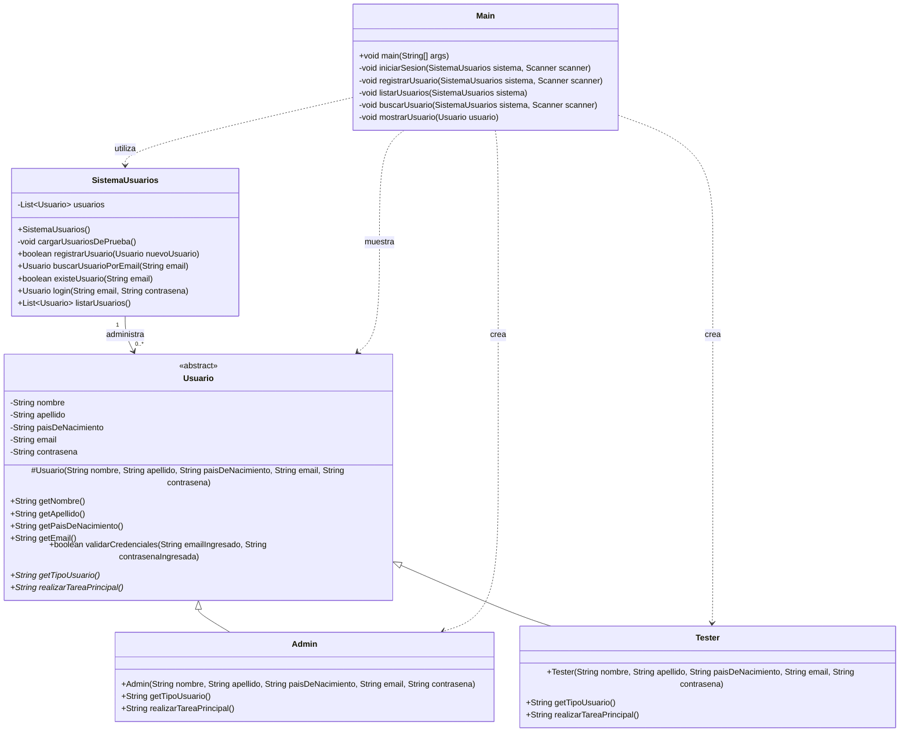

FUNCIONALIDADES DE http://cestore.ces.com.uy/adminces/
------------------------------------------------------

--------------- PREVIO A ESTAR LOGUEADO AL SISTEMA

* INICIAR SESIÓN
        - Iniciar sesión administrador (email y contraseña)
        - Cambiar contraseña
  
* REGISTRARSE
        - Crear cuenta de administrador (Nombre, apellido, email, contaseña, repetir contraseña, país de nacimiento)
        - Cambiar contraseña

* REINICIAR CONTRASEÑA
        - Reiniciar contraseña (Email, contraseña, repetir contraseña)

--------------- LOGUEADO AL SISTEMA

* CREAR USUARIO
        - Alta de cuenta para tester (Nombre, apellido, email, país de nacimiento, contraseña por defecto, tester (junior, senior, líder))

* REINICIAR CONTRASEÑA
        - Reiniciar contraseña (Email, contraseña, repetir contraseña)

* VER USUARIOS
        - Usuarios registrados en el sistema (datos de usuarios, botón borrar usuarios)

* ELIMINAR USUARIOS
        - Eliminar usuarios registrados

* VER PERFIL DE USUARIO LOGUEADO
        - Detalles del perfil (Nombre, apellido, email, país, perfil)

* EDITAR PERFIL
        - Detalles del perfil (Nombre, apellido, email, país, perfil)

* CERRAR SESIÓN
        - Cerrar la sesión activa del usuario logueado

DIAGRAMA DE CLASES UML
## Diagrama UML

