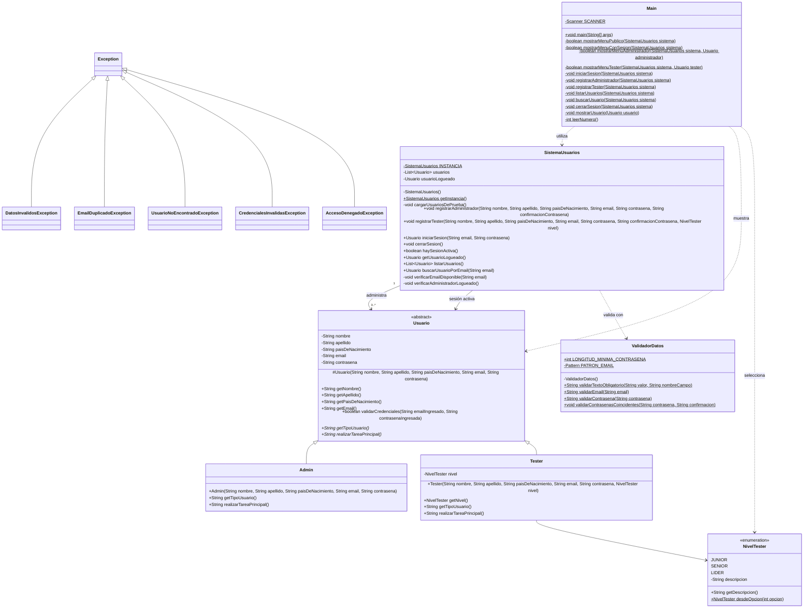

FUNCIONALIDADES DE http://cestore.ces.com.uy/adminces/
------------------------------------------------------

SISTEMA DE GESTIÓN DE USUARIOS

OBJETIVO: Administrar usuarios de tipo "Administrador" y "Tester" desde una aplicación de consola.


----- FUNCIONALIDADES -----

**** Sin sesión iniciada ****
- Iniciar sesión
- Registrar un nuevo administrador
- Salir del programa

**** Con sesión de administrador ****

- Dar de alta usuarios Tester
- Seleccionar el nivel del Tester: Junior, Senior o Líder
- Listar todos los usuarios
- Buscar usuarios por email
- Ver el perfil del administrador logueado
- Cerrar sesión
- Salir del programa

**** Con sesión de Tester ****

- Ver el perfil propio
- Cerrar sesión
- Salir del programa


---- VALIDACIONES ----

- Los campos obligatorios no pueden estar vacíos
- El email debe tener un formato válido
- No pueden registrarse dos usuarios con el mismo email
- La contraseña debe tener un mínimo de 6 caracteres
- La contraseña y su confirmación deben coincidir
- Las opciones de los menús deben ser numéricas y existentes
- El nivel del Tester debe ser válido
- Solo los administradores pueden gestionar usuarios


---- EXCEPCIONES ----

El sistema utiliza las siguientes excepciones:
- `NumberFormatException`
- `IllegalArgumentException`
- `DatosInvalidosException`
- `EmailDuplicadoException`
- `UsuarioNoEncontradoException`
- `CredencialesInvalidasException`
- `AccesoDenegadoException`

Los errores son informados al usuario y el sistema continúa ejecutándose sin finalizar inesperadamente.


---- MEJORA DE DISEÑO ----

La clase `SistemaUsuarios` implementa el patrón **Singleton**, por lo que existe una única instancia encargada de administrar la colección de usuarios y la sesión activa.

También se aplican:

- Encapsulamiento de atributos.
- Herencia y abstracción mediante la clase abstracta `Usuario`.
- Separación de responsabilidades.
- Uso de `ArrayList` para administrar usuarios.
- Clase `ValidadorDatos` para centralizar las validaciones.
- Enum `NivelTester` para representar niveles válidos sin usar textos libres.


---- USUARIOS DE PRUEBA ----

* ADMIN
- Email: `cforteza@ces.com.uy`
- Contraseña: `123456`

* TESTERS
- Email: `lsuarez@ces.com.uy`
- Contraseña: `123456`

- Email: `ecavani@ces.com.uy`
- Contraseña: `123456`

Los datos se almacenan en memoria, por lo que los usuarios creados durante la ejecución no se conservan después de cerrar el programa.


---- REQUISITOS pARA EJECUTAR EL PROGRAMA ----

- Java 11 o superior. IntelliJ IDEA u otro entorno compatible con Java.


* Ejecución en IntelliJ IDEA

1. Abrir el proyecto en IntelliJ IDEA.
2. Verificar que el SDK configurado sea Java 11 o superior.
3. Abrir `src/AdminCES/Main.java`.
4. Ejecutar el método `main`.


* Ejecución desde una terminal

Desde la carpeta principal del proyecto:

```bash
javac -encoding UTF-8 -d out src/AdminCES/*.java
java -cp out AdminCES.Main
```

## Diagrama de clases UML


